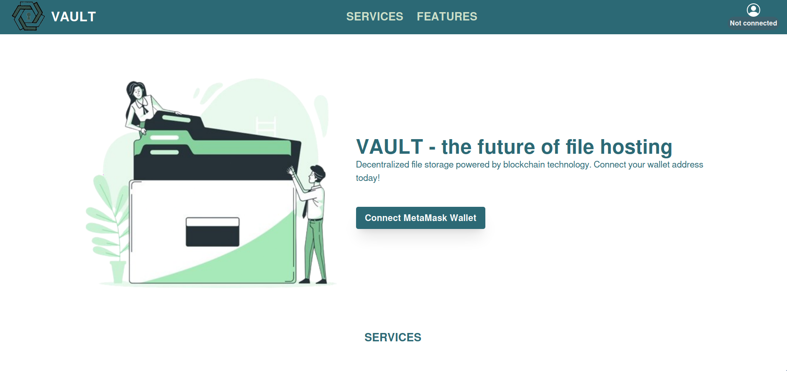
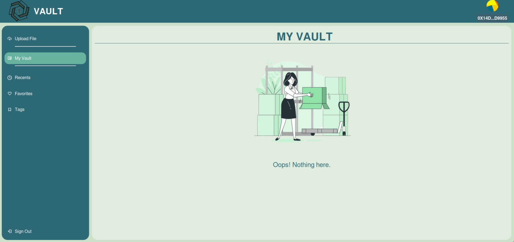
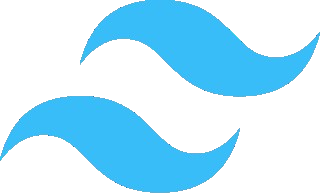

    
    <h1>VAULT</h1>

## Table of Contents

- [Table of Contents](#table-of-contents)
- [Demo](#demo)
- [Introduction](#introduction)
- [Members](#members)
- [Background](#background)
- [What Vault Offers](#what-vault-offers)
- [Implementation](#implementation)
- [Design](#design)
- [Tech Stack](#tech-stack)
- [Currently Available Features](#currently-available-features)
- [Future Plans](#future-plans)

## Demo

<video width="640" height="360" controls>
  <source src="./demo.mp4" type="video/mp4">
</video>

## Introduction

Vault is a revolutionary decentralized dapp that empowers users to have full control over their data, specifically files. This repository contains the frontend implementation of the dapp. The backend repository can be found [here](https://github.com/Karume-lab/Vault-BE).

## Members

- [Peaches Njenga](https://github.com/Peachy-Njenga/) - Frontend
- [Karume Daniel](https://github.com/Karume-lab/) - Backend and Frontend

## Background

The motivation for decentralized app storage arises from mounting concerns surrounding data theft, the utilization of personal data for AI training, and the monopolistic control exerted by tech giants over data. In today's digital landscape, centralized data storage poses significant risks, including vulnerability to unauthorized access, data breaches, and manipulation for commercial or political purposes. These concerns have underscored the urgent need for alternative storage solutions that prioritize data security, privacy, and user control.

## What Vault Offers

Vault stands out for its commitment to user-friendliness, ease of use, ease of organisation of files and downloading them. By prioritizing these aspects, Vault aims to provide a hassle-free and efficient experience for users.

Vault offers a robust solution to address the pressing need for secure and decentralized data storage. By leveraging blockchain technology, Vault ensures data security and decentralization, mitigating concerns related to data security and centralized control.

## Implementation

Users initiate their journey from the lanidng page which has information about what the dpp offers. They can connect  their wallet addresses from this landing page through MetaMask. They can then upload their files to Vault, view these uploaded files and even download them. Vault offers options for marking files as favorites and organizing them under different tags such as education, healt and personal files. Users can view files marked as favorites and files under the different tags. Additionally, they can sort files listings by date, tags, or alphabetical order. 

 Files are securely stored using IPFS via Pinata. Notably, only the hash value (CID) for each file is stored on the blockchain, as direct file storage comes with a high cost in terms of blockchain gas fees. This approach strikes a balance between data security and cost-effectiveness. See the backend repository [here](https://github.com/Karume-lab/Vault-BE) for more information on this.

## Architecture

The frontend is built using ReactJS deployed locally. The backend is deployed locally with Hardhat.

## Design

Below are sapmles of the dapp. The app consists of two primary containers: the sidebar and the content being displayed. Clicking on the sidebar displays different content on the right side.

## Tech Stack

    

        
        
HTML

    

    

        
        
Tailwind for styling

    

    

        
        
React

    

    

        
        
Visual Studio Code: Integrated development environment (IDE) for coding and editing software

    

## Currently Available Features

1. **Uploading Files to the Blockchain**: Users can upload their files directly to the blockchain through the Vault dapp. This process ensures that the files are securely stored on the decentralized network, providing immutability and tamper-proofing.

2. **Viewing Files Uploaded to the Blockchain**: Once uploaded, users can view and access their files directly through the Vault dapp. This allows users to manage their files and access them from anywhere with an internet connection.

3. **Connecting Wallet Addresses from MetaMask**: The integration with MetaMask enables users to connect their Ethereum wallet addresses to the Vault dapp. This connection is necessary for interacting with the blockchain, such as uploading files, accessing stored files, and managing account settings.

4. **Downloading Uploaded Files to the Local Computer**: Users have the ability to download their uploaded files from the blockchain to their local computer. This feature ensures that users can retrieve and use their files outside of the Vault dapp as needed.

5. **Marking Files as Favorites**: Users can mark specific files as favorites within the Vault dapp. This feature allows users to quickly access and identify their most frequently used or important files.

6. **Uploading Files with Specific Tags for Faster Retrieval**: Users can assign specific tags to their uploaded files to categorize and organize them. Tags enable faster retrieval of files based on relevant keywords or categories, enhancing the user experience and efficiency of file management.

7. **Searching, Filtering, and Sorting**: This involves enhancing the user experience by implementing functionality that allows users to search for specific files, filter files based on criteria like tags or upload date, and sort files in different orders (e.g., alphabetical, chronological).

## Future Plans

2. **Subscriptions and Freemium Model**: The team plans to introduce subscription-based features using a freemium model. Freemium refers to offering basic services for free while charging for premium features. This could involve different tiers of subscription plans with varying levels of access or features. Limits may be imposed on daily activities like file shares and uploads for users on the free plan.

3. **Improved UI Responsiveness**: Enhancing the responsiveness of the user interface ensures that the application adapts well to different screen sizes and devices. This includes optimizing layout, design, and interactions to provide a seamless experience across desktop and mobile platforms.

4. **Multiple Tags for Files**: Allowing files to have multiple tags enables users to categorize and organize their files more effectively. This flexibility enhances search and retrieval capabilities, as files can be associated with multiple topics or categories.

5. **Collecting More User Details**: Gathering additional user details during the wallet connection stage can enhance user profiles and provide valuable insights for personalization and targeted features. This may include preferences, usage patterns, and demographic information.

6. **Rewarding Users with Ethers**: Implementing a rewards system where users earn ethers (cryptocurrency) for sharing Vaults via the platform incentivizes user engagement and promotes growth. Users may receive ethers based on various criteria, such as the number of shares or the popularity of their shared content.
